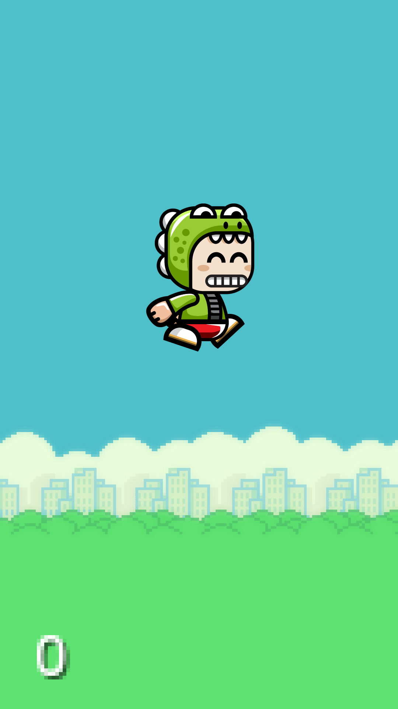
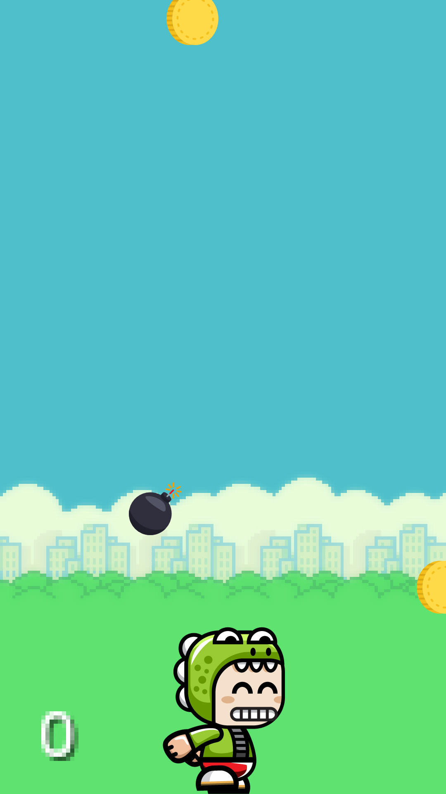
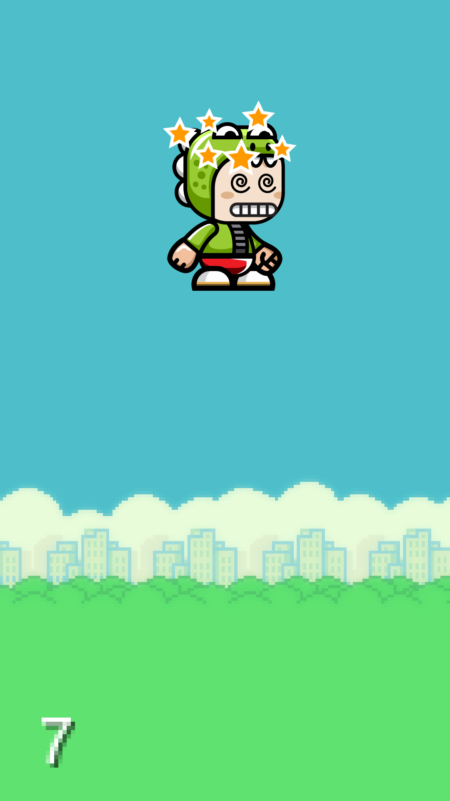

# Coin-man-game
It is an android application which is kind of a hybrid between Google's Offline Easter Egg game and the Super Mario game.

It is built on Android Studio platform using the Maven repository and libGDX framework.

Here are some of the screenshots of the game:

            

The coin man gains points when it collides with a coin and loses when it collides with a bomb and then can restart the game.
The coin man goes in the air by repeated touch of the screen and comes down when their is no touch on the screen.
